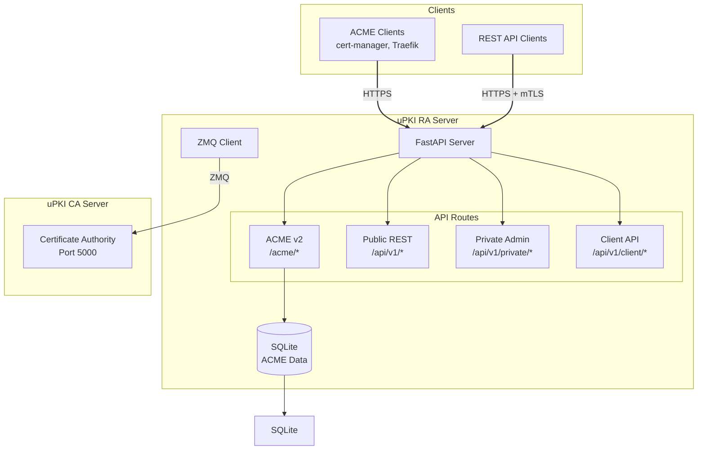
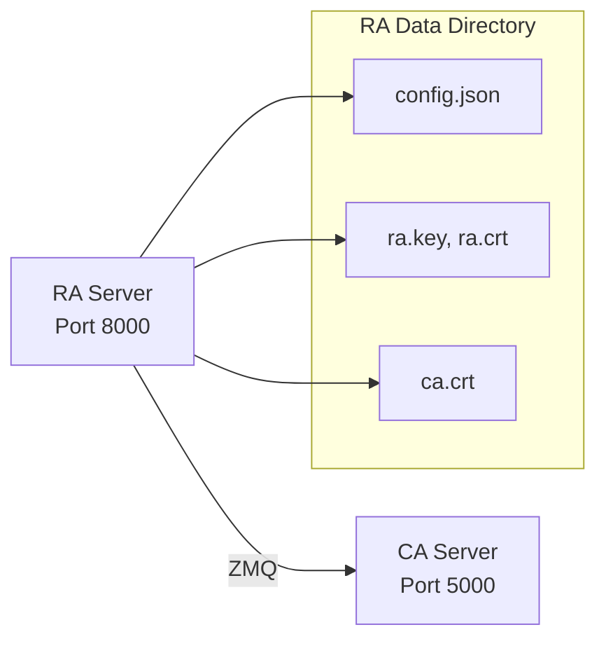

# uPKI RA Server

[](https://opensource.org/licenses/MIT)
[](https://www.python.org/)
[](https://github.com/astral-sh/ruff)

Registration Authority (RA) Server for the uPKI Public Key Infrastructure system. Provides a complete ACME v2 server implementation for automated certificate management.

## Overview

The uPKI RA Server acts as an intermediary between clients and the Certificate Authority (CA), supporting multiple certificate enrollment protocols:

- **ACME v2** (RFC 8555) - Automated Certificate Management Environment
- **REST API** - Traditional CSR-based certificate enrollment
- **mTLS Authentication** - Certificate-based client authentication

## Architecture



## Key Features

- **ACME v2 Server** — Complete RFC 8555 implementation supporting HTTP-01 and DNS-01 challenge validation
- **Multi-Protocol Support** — ACME, REST API, and mTLS authentication
- **Certificate Lifecycle Management** — Enrollment, renewal, and revocation
- **Auto-bootstrap** — The `start` command registers the RA with the CA on first boot and starts the server automatically, with no manual intervention
- **TLS by default (Docker)** — The RA serves HTTPS using its own RA certificate, as required by Traefik's built-in ACME client (LEGO)
- **Kubernetes Integration** — Works with cert-manager as a custom ACME issuer
- **Traefik Integration** — Direct ACME integration for private networks where Let's Encrypt is not accessible

## Requirements

- Python 3.11+
- Poetry (package manager)
- cryptography library

## Installation

### 1. Clone the Repository

```bash
git clone https://github.com/circle-rd/upki-ra.git
cd upki-ra
```

### 2. Install Dependencies

```bash
poetry install
```

### 3. Initialize RA

```bash
poetry run python ra_server.py init
```

### 4. Register with CA

```bash
poetry run python ra_server.py register -s <registration_seed>
```

### 5. Start the Server

```bash
# Default: http://127.0.0.1:8000
poetry run python ra_server.py listen

# Custom bind address and port
poetry run python ra_server.py listen --web-ip 0.0.0.0 --web-port 8443
```

### Alternative: Docker Auto-bootstrap

The `start` command automates the full lifecycle: it runs `register` on the first boot (when no `ra.crt` is present on the data volume), then calls `listen`. This is the default Docker entrypoint.

```bash
# All configuration via environment variables
UPKI_DATA_DIR=/data \
UPKI_CA_HOST=upki-ca \
UPKI_CA_SEED=<seed> \
  poetry run python ra_server.py start
```

## Environment Variables

All CLI flags can be overridden by environment variables, which is the recommended approach for Docker and systemd deployments. CLI flags always take precedence over environment variables.

| Variable        | Default                  | Description                                                                   |
| --------------- | ------------------------ | ----------------------------------------------------------------------------- |
| `UPKI_DATA_DIR` | `~/.upki/ra`             | Data directory (certs, config, ACME database)                                 |
| `UPKI_CA_HOST`  | `127.0.0.1`              | CA server hostname or IP (`-i` flag)                                          |
| `UPKI_CA_PORT`  | `5000`                   | CA server ZMQ port (`-p` flag)                                                |
| `UPKI_CA_SEED`  | —                        | Registration seed — required for `start` on first boot                        |
| `UPKI_RA_HOST`  | `127.0.0.1`              | Web server bind address (`--web-ip` flag)                                     |
| `UPKI_RA_PORT`  | `8000`                   | Web server port (`--web-port` flag)                                           |
| `UPKI_RA_TLS`   | `true` (Docker image)    | Serve HTTPS using the RA certificate                                          |
| `UPKI_RA_SANS`  | `upki-ra` (Docker image) | Comma-separated DNS SANs embedded in the RA certificate at first registration |
| `UPKI_RA_CN`    | `RA`                     | Common Name embedded in the RA certificate                                    |

> **Note on `UPKI_RA_TLS` and `UPKI_RA_SANS`**: these are set as `ENV` defaults in the Docker image (values `true` and `upki-ra`). For local/bare-metal deployments both default to their unset values (`false` / empty). `UPKI_RA_SANS` is only used at first registration — changing it after the RA certificate has been issued has no effect.

## ACME Server Setup

### With cert-manager (Kubernetes)

```yaml
apiVersion: cert-manager.io/v1
kind: ClusterIssuer
metadata:
  name: upki-issuer
spec:
  acme:
    server: https://your-ra-server.com/acme/directory
    email: admin@example.com
    privateKeySecretRef:
      name: upki-account-key
    solvers:
      - http01:
          ingressClassName: traefik
```

### With Traefik (private / air-gapped networks)

uPKI is designed as a drop-in replacement for Let's Encrypt in environments where internet access is unavailable. Traefik's built-in ACME client (LEGO) connects directly to the RA as a custom CA server.

Two prerequisites must be met before Traefik can obtain certificates:

1. **The RA must serve HTTPS** — `UPKI_RA_TLS=true` (the default in the Docker image). LEGO requires TLS on the ACME endpoint.
2. **Traefik must trust the internal CA certificate** — the RA certificate is signed by the uPKI CA; Traefik's Alpine-based image must have `ca.crt` injected into its trust store before starting.

```yaml
# traefik.yml (static configuration)
certificatesResolvers:
  upki:
    acme:
      caServer: https://upki-ra:8000/acme/directory
      storage: /acme/acme.json
      httpChallenge:
        entryPoint: web
```

See [Traefik Integration](docs/TRAEFIK_INTEGRATION.md) for the full Docker Compose setup, CA certificate injection, DNS resolver configuration, and troubleshooting.

## API Endpoints

### ACME v2 Endpoints

| Endpoint                              | Method   | Description                |
| ------------------------------------- | -------- | -------------------------- |
| `/acme/directory`                     | GET      | ACME directory             |
| `/acme/new-nonce`                     | GET/HEAD | Get new nonce              |
| `/acme/new-account`                   | POST     | Create account             |
| `/acme/new-order`                     | POST     | Create order               |
| `/acme/authz/{id}`                    | GET      | Authorization status       |
| `/acme/challenge/{id}/http-01`        | POST     | Validate HTTP-01 challenge |
| `/acme/challenge/{id}/dns-01`         | POST     | Validate DNS-01 challenge  |
| `/.well-known/acme-challenge/{token}` | GET      | HTTP-01 challenge response |
| `/acme/order/{id}/finalize`           | POST     | Finalize order             |
| `/acme/cert/{id}`                     | GET      | Download certificate       |
| `/acme/revoke-cert`                   | POST     | Revoke certificate         |

### REST API Endpoints

| Endpoint           | Method | Description        |
| ------------------ | ------ | ------------------ |
| `/api/v1/health`   | GET    | Health check       |
| `/api/v1/certify`  | POST   | Enroll certificate |
| `/api/v1/certs`    | GET    | List certificates  |
| `/api/v1/crl`      | GET    | Get CRL            |
| `/api/v1/profiles` | GET    | List profiles      |

## Project Organization

```
upki-ra/
├── ra_server.py              # Main entry point
├── pyproject.toml            # Poetry configuration
├── README.md                 # This file
├── docs/
│   ├── TRAEFIK_INTEGRATION.md
│   ├── CA_ZMQ_PROTOCOL.md
│   ├── SPECIFICATIONS_RA.md
│   └── SPECIFICATIONS_CA.md
├── upki_ra/
│   ├── __init__.py
│   ├── registration_authority.py   # Core RA class
│   ├── core/
│   │   ├── upki_error.py           # Exception classes
│   │   └── upki_logger.py          # Logging
│   ├── routes/
│   │   ├── acme_api.py             # ACME v2 endpoints
│   │   ├── public_api.py           # Public REST endpoints
│   │   ├── private_api.py          # Admin endpoints
│   │   └── client_api.py            # Client endpoints
│   ├── storage/
│   │   ├── abstract.py             # Storage interface
│   │   └── sqlite_storage.py        # SQLite implementation
│   └── utils/
│       ├── common.py                 # Utilities
│       ├── tlsauth.py               # TLS authentication
│       └── tools.py                 # ZMQ client & ACME client
└── tests/
    ├── test_core.py
    ├── test_utils.py
    └── test_routes.py
```

## CA Integration

The RA server communicates with the CA server via ZMQ. For detailed protocol specifications, see the [CA ZMQ Protocol Documentation](docs/CA_ZMQ_PROTOCOL.md).



## Docker Deployment

### Minimal Docker Compose

The example below shows the minimal configuration needed to deploy the uPKI stack with Traefik. `UPKI_RA_TLS` and `UPKI_RA_SANS` are already set as defaults in the Docker image and do not need to be redeclared unless you want to override them.

```yaml
services:
  upki-ca:
    image: ghcr.io/circle-rd/upki-ca:latest
    restart: unless-stopped
    environment:
      UPKI_DATA_DIR: /data
      UPKI_CA_SEED: ${PKI_SEED}
    volumes:
      - upki-ca-data:/data
    networks:
      - demo-net
    healthcheck:
      test:
        [
          "CMD-SHELL",
          'python -c ''import socket; s=socket.socket(); s.settimeout(2); s.connect(("127.0.0.1", 5000)); s.close()''',
        ]
      interval: 10s
      timeout: 5s
      retries: 10
      start_period: 10s

  upki-ra:
    image: ghcr.io/circle-rd/upki-ra:latest
    restart: unless-stopped
    depends_on:
      upki-ca:
        condition: service_healthy
    environment:
      UPKI_DATA_DIR: /data
      UPKI_CA_HOST: upki-ca
      UPKI_CA_SEED: ${PKI_SEED}
      UPKI_RA_HOST: 0.0.0.0
      # UPKI_RA_TLS=true and UPKI_RA_SANS=upki-ra are already set in the image
    volumes:
      - upki-ra-data:/data
    networks:
      - demo-net

  traefik:
    image: traefik:v3
    restart: unless-stopped
    depends_on:
      upki-ra:
        condition: service_healthy
    entrypoint:
      - /bin/sh
      - -c
      - |
        cp /ra-data/ca.crt /usr/local/share/ca-certificates/upki-ca.crt
        update-ca-certificates
        exec traefik
    environment:
      TRAEFIK_CERTIFICATESRESOLVERS_UPKI_ACME_EMAIL: ${ADMIN_EMAIL}
    ports:
      - "80:80"
      - "443:443"
    volumes:
      - /var/run/docker.sock:/var/run/docker.sock:ro
      - acme:/acme
      - ./traefik.yml:/etc/traefik/traefik.yml:ro
      - upki-ra-data:/ra-data:ro # Read CA cert from RA data volume
    networks:
      - demo-net

volumes:
  upki-ca-data:
  upki-ra-data:
  acme:

networks:
  demo-net:
```

See [Traefik Integration](docs/TRAEFIK_INTEGRATION.md) for the full configuration reference including DNS resolver setup and Traefik service labels.

## Development

### Running Tests

```bash
poetry run pytest tests/
```

### Code Style

```bash
poetry run ruff check .
poetry run ruff format .
```

## Related Projects

- [uPKI CA Server](https://github.com/circle-rd/upki-ca) — Certificate Authority, ZMQ backend for this RA
- [uPKI CLI](https://github.com/circle-rd/upki-cli) — Client application for certificate enrolment and renewal

## License

MIT License
