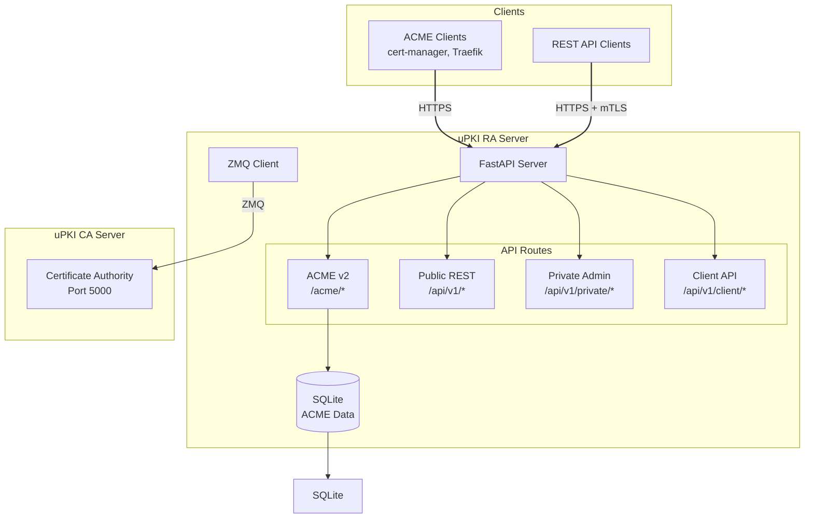
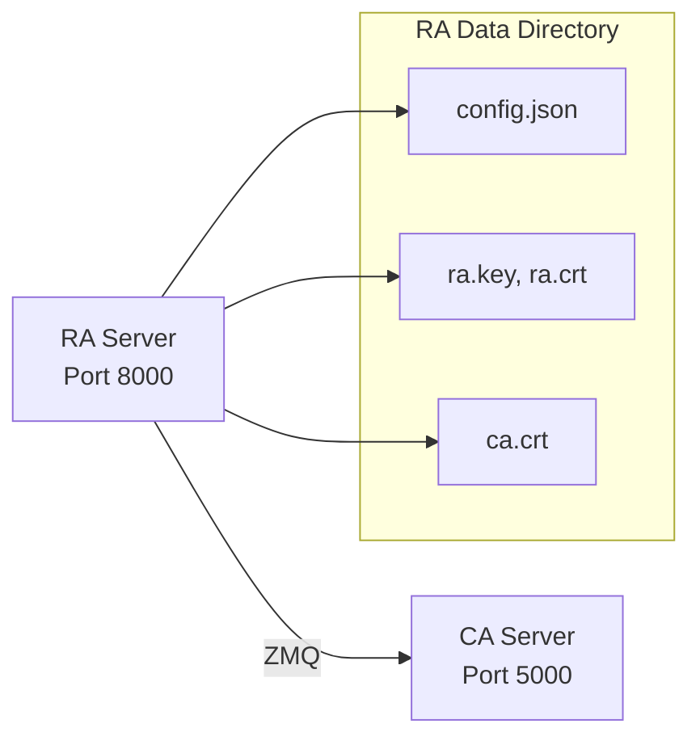

# uPKI RA Server

[](https://opensource.org/licenses/MIT)
[](https://www.python.org/)
[](https://github.com/astral-sh/ruff)

Registration Authority (RA) Server for the uPKI Public Key Infrastructure system. Provides a complete ACME v2 server implementation for automated certificate management.

## Overview

The uPKI RA Server acts as an intermediary between clients and the Certificate Authority (CA), supporting multiple certificate enrollment protocols:

- **ACME v2** (RFC 8555) - Automated Certificate Management Environment
- **REST API** - Traditional CSR-based certificate enrollment
- **mTLS Authentication** - Certificate-based client authentication

## Architecture



## Key Features

- **ACME v2 Server** - Complete implementation supporting HTTP-01 and DNS-01 challenge validation
- **Multi-Protocol Support** - ACME, REST API, and mTLS authentication
- **Certificate Lifecycle Management** - Enrollment, renewal, and revocation
- **Kubernetes Integration** - Works with cert-manager as ACME issuer
- **Traefik Integration** - Native ACME support for Traefik reverse proxy

## Requirements

- Python 3.11+
- Poetry (package manager)
- cryptography library

## Installation

### 1. Clone the Repository

```bash
git clone https://github.com/circle-rd/upki-ra.git
cd upki-ra
```

### 2. Install Dependencies

```bash
poetry install
```

### 3. Initialize RA

```bash
poetry run python ra_server.py init
```

### 4. Register with CA

```bash
poetry run python ra_server.py register -s <registration_seed>
```

### 5. Start the Server

```bash
# Default: http://127.0.0.1:8000
poetry run python ra_server.py listen

# Custom configuration
poetry run python ra_server.py listen --web-ip 0.0.0.0 --web-port 8443
```

## ACME Server Setup

### With cert-manager (Kubernetes)

```yaml
apiVersion: cert-manager.io/v1
kind: ClusterIssuer
metadata:
  name: upki-issuer
spec:
  acme:
    server: https://your-ra-server.com/acme/directory
    email: admin@example.com
    privateKeySecretRef:
      name: upki-account-key
    solvers:
      - http01:
          ingressClassName: traefik
```

### With Traefik

Configure Traefik to use uPKI as the ACME server. See [Traefik Integration](docs/TRAEFIK_INTEGRATION.md) for detailed configuration.

## API Endpoints

### ACME v2 Endpoints

| Endpoint                              | Method   | Description                |
| ------------------------------------- | -------- | -------------------------- |
| `/acme/directory`                     | GET      | ACME directory             |
| `/acme/new-nonce`                     | GET/HEAD | Get new nonce              |
| `/acme/new-account`                   | POST     | Create account             |
| `/acme/new-order`                     | POST     | Create order               |
| `/acme/authz/{id}`                    | GET      | Authorization status       |
| `/acme/challenge/{id}/http-01`        | POST     | Validate HTTP-01 challenge |
| `/acme/challenge/{id}/dns-01`         | POST     | Validate DNS-01 challenge  |
| `/.well-known/acme-challenge/{token}` | GET      | HTTP-01 challenge response |
| `/acme/order/{id}/finalize`           | POST     | Finalize order             |
| `/acme/cert/{id}`                     | GET      | Download certificate       |
| `/acme/revoke-cert`                   | POST     | Revoke certificate         |

### REST API Endpoints

| Endpoint           | Method | Description        |
| ------------------ | ------ | ------------------ |
| `/api/v1/health`   | GET    | Health check       |
| `/api/v1/certify`  | POST   | Enroll certificate |
| `/api/v1/certs`    | GET    | List certificates  |
| `/api/v1/crl`      | GET    | Get CRL            |
| `/api/v1/profiles` | GET    | List profiles      |

## Project Organization

```
upki-ra/
├── ra_server.py              # Main entry point
├── pyproject.toml            # Poetry configuration
├── README.md                 # This file
├── docs/
│   ├── TRAEFIK_INTEGRATION.md
│   ├── CA_ZMQ_PROTOCOL.md
│   ├── SPECIFICATIONS_RA.md
│   └── SPECIFICATIONS_CA.md
├── upki_ra/
│   ├── __init__.py
│   ├── registration_authority.py   # Core RA class
│   ├── core/
│   │   ├── upki_error.py           # Exception classes
│   │   └── upki_logger.py          # Logging
│   ├── routes/
│   │   ├── acme_api.py             # ACME v2 endpoints
│   │   ├── public_api.py           # Public REST endpoints
│   │   ├── private_api.py          # Admin endpoints
│   │   └── client_api.py            # Client endpoints
│   ├── storage/
│   │   ├── abstract.py             # Storage interface
│   │   └── sqlite_storage.py        # SQLite implementation
│   └── utils/
│       ├── common.py                 # Utilities
│       ├── tlsauth.py               # TLS authentication
│       └── tools.py                 # ZMQ client & ACME client
└── tests/
    ├── test_core.py
    ├── test_utils.py
    └── test_routes.py
```

## CA Integration

The RA server communicates with the CA server via ZMQ. For detailed protocol specifications, see the [CA ZMQ Protocol Documentation](docs/CA_ZMQ_PROTOCOL.md).



## Development

### Running Tests

```bash
poetry run pytest tests/
```

### Code Style

```bash
poetry run ruff check .
poetry run ruff format .
```

## Related Projects

- [uPKI CA Server](https://github.com/circle-rd/upki-ca) — Certificate Authority, ZMQ backend for this RA
- [uPKI CLI](https://github.com/circle-rd/upki-cli) — Client application for certificate enrolment and renewal

## License

MIT License
