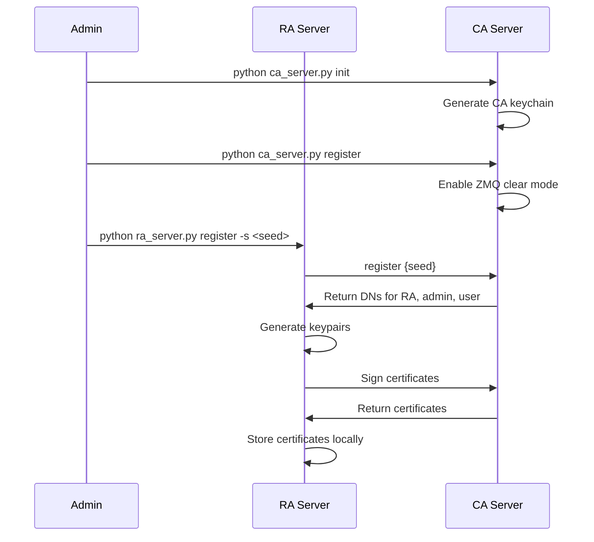
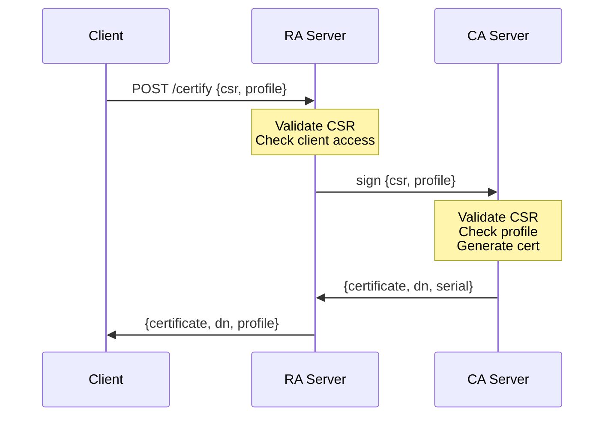
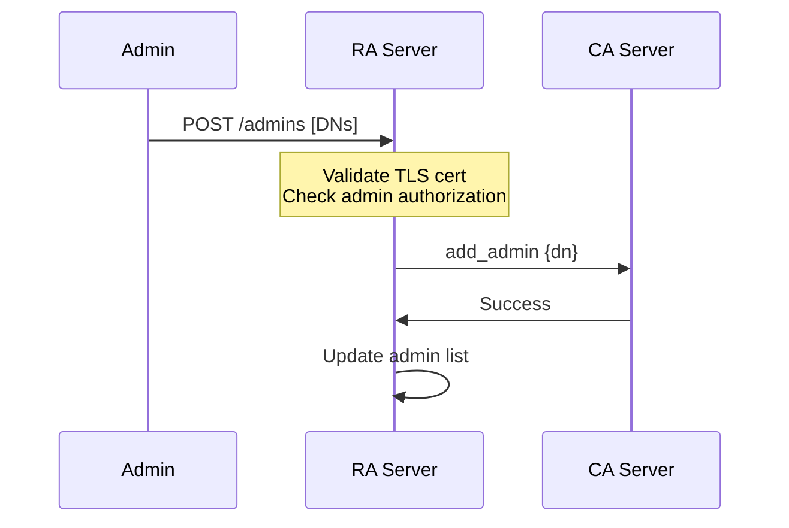

# uPKI RA Server - Specification Document

## Table of Contents

1. [Project Overview](#1-project-overview)
2. [Architecture](#2-architecture)
3. [Main Components](#3-main-components)
4. [API Endpoints](#4-api-endpoints)
5. [Communication with CA](#5-communication-with-ca)
6. [Security](#6-security)
7. [Configuration](#7-configuration)
8. [Workflow](#8-workflow)
9. [Data Structures](#9-data-structures)

---

## 1. Project Overview

| Property         | Value                                                           |
| ---------------- | --------------------------------------------------------------- |
| **Project Name** | uPKI Registration Authority (RA) Server                         |
| **Language**     | Python 3.11+                                                    |
| **Purpose**      | Registration Authority handling certificate enrollment requests |
| **License**      | MIT                                                             |
| **Framework**    | Flask + ZMQ                                                     |

### 1.1 Core Capabilities

- Certificate enrollment via REST API
- CSR validation and forwarding to CA
- Node/endpoint registration
- Administrator management
- Certificate distribution (CDP)
- OCSP responder integration

---

## 2. Architecture

### 2.1 Project Structure

```
upki-ra/
├── ra_server.py                    # Main entry point
├── server/
│   ├── registrationAuthority.py      # Core RA class
│   ├── core/
│   │   ├── upkiError.py            # Exception handling
│   │   └── upkiLogger.py           # Logging
│   ├── routes/
│   │   ├── publicAPI.py            # Public endpoints
│   │   ├── privateAPI.py           # Admin endpoints
│   │   └── clientAPI.py            # Client endpoints
│   └── utils/
│       ├── common.py               # Utilities
│       ├── tlsauth.py              # TLS authentication
│       └── tools.py                # Helper tools
└── data/                           # Configuration files
```

### 2.2 Component Diagram

```mermaid
graph TB
    subgraph RA
        Flask[Flask App]
        RA[RegistrationAuthority]
        PublicAPI[Public API]
        PrivateAPI[Private API]
        ClientAPI[Client API]
    end

    subgraph CA
        ZMQ[ZMQ Listener]
    end

    Clients[Clients] --> Flask
    Admins[Admins] --> Flask
    Flask --> RA
    RA --> ZMQ
    ZMQ --> CA
```

---

## 3. Main Components

### 3.1 RegistrationAuthority Class

**File**: [`server/registrationAuthority.py`](server/registrationAuthority.py:12)

Core class managing RA operations.

**Initialization**:

```python
def __init__(self, logger, path, host, port)
```

**Key Attributes**:

- `_path`: RA data directory
- `_ca_url`: CA server ZMQ endpoint
- `nodes`: Dictionary of registered nodes
- `profiles`: Available certificate profiles

**Key Methods**:

```python
def register(seed: str) -> dict
def register_node(data: dict) -> dict
def sign_node(data: dict) -> dict
def list_nodes() -> list
def list_admins() -> list
def add_admin(dn: str) -> bool
def remove_admin(dn: str) -> bool
def get_ca() -> str
def get_crl() -> str
def download_node(data: dict) -> str
def generate_command(profile: str, data: dict) -> str
def check_ocsp(data: dict) -> dict
```

### 3.2 RA Initialization Process

On initialization, the RA:

1. Connects to CA via ZMQ
2. Retrieves CA certificate and validates it
3. Downloads and stores CRL
4. Fetches available profiles
5. Creates necessary directories

```python
# Initialization sequence
ca_pem = self.get_ca()           # Get CA cert
crl_pem = self.get_crl()          # Get CRL
self.list_profiles()             # Load profiles
os.makedirs(self._path)          # Create directories
```

---

## 4. API Endpoints

### 4.1 Public API

**File**: [`server/routes/publicAPI.py`](server/routes/publicAPI.py)

No authentication required.

| Endpoint           | Method | Description              |
| ------------------ | ------ | ------------------------ |
| `/certs/<node>`    | GET    | Get certificate or CRL   |
| `/ocsp`            | POST   | OCSP status check        |
| `/certify`         | POST   | Submit CSR for signing   |
| `/magic/<profile>` | POST   | Generate openssl command |

#### GET /certs/<node>

Certificate Distribution Point (CDP).

**Path Parameters**:

- `node`: Certificate identifier or special values

**Special Values**:

- `ca.crt` - CA certificate
- `crl.pem` - Certificate Revocation List
- Base64-encoded DN for specific certificates

**Response**:

```http
HTTP/1.1 200 OK
Content-Type: application/x-x509-ca-cert

-----BEGIN CERTIFICATE-----
...
-----END CERTIFICATE-----
```

#### POST /ocsp

OCSP responder endpoint.

**Request Body**:

```json
{
  "cert": "base64_encoded_cert",
  "issuer": "base64_encoded_issuer"
}
```

**Response**:

```http
HTTP/1.1 200 OK
Content-Type: application/ocsp-response

<binary OCSP response>
```

#### POST /certify

Certificate enrollment endpoint (SCEP-like).

**Request Body**:

```json
{
  "csr": "-----BEGIN CERTIFICATE REQUEST-----\n...",
  "profile": "server"
}
```

**Response**:

```json
{
  "status": "success",
  "certificate": "-----BEGIN CERTIFICATE-----\n...",
  "dn": "/C=FR/O=Company/CN=example.com",
  "profile": "server"
}
```

**Access Control** (based on `clients` config):

- `all` - Accept any CSR (insecure)
- `register` - Only registered nodes
- `manual` - Disabled

#### POST /magic/<profile>

Generate openssl command for certificate generation.

**Path Parameters**:

- `profile`: Certificate profile name

**Request Body**:

```json
{
  "cn": "example.com",
  "sans": ["www.example.com"]
}
```

**Response**:

```json
{
  "status": "success",
  "command": "openssl req -new -key ... -out ... -subj ..."
}
```

### 4.2 Private API

**File**: [`server/routes/privateAPI.py`](server/routes/privateAPI.py)

Requires mTLS authentication with admin certificate.

| Endpoint       | Method | Description         |
| -------------- | ------ | ------------------- |
| `/options`     | GET    | Get allowed options |
| `/nodes`       | GET    | List all nodes      |
| `/nodes`       | POST   | Register new node   |
| `/admins`      | GET    | List admins         |
| `/admins`      | POST   | Add admin           |
| `/admins/<dn>` | DELETE | Remove admin        |

#### GET /options

Get allowed certificate parameters.

**Response**:

```json
{
  "status": "success",
  "options": {
    "keyType": ["rsa", "dsa"],
    "keyLen": [1024, 2048, 4096],
    "digest": ["sha256", "sha512"],
    ...
  }
}
```

#### GET /nodes

List all registered nodes.

**Response**:

```json
{
  "status": "success",
  "nodes": [
    {
      "DN": "/C=FR/O=Company/CN=example.com",
      "CN": "example.com",
      "Profile": "server",
      "State": "active",
      "Serial": 1234567890
    }
  ]
}
```

#### POST /nodes

Register a new node.

**Request Body**:

```json
{
  "cn": "example.com",
  "profile": "server",
  "sans": ["www.example.com"]
}
```

**Response**:

```json
{
  "status": "success",
  "node": {
    "DN": "/C=FR/O=Company/CN=example.com",
    "CN": "example.com",
    "Profile": "server",
    "State": "pending",
    "Serial": null
  }
}
```

#### GET /admins

List all administrators.

**Response**:

```json
{
  "status": "success",
  "admins": [{ "dn": "/C=FR/O=Company/CN=admin" }]
}
```

#### POST /admins

Add administrator(s).

**Request Body**:

```json
["/C=FR/O=Company/CN=admin1", "/C=FR/O=Company/CN=admin2"]
```

**Response**:

```json
{
  "status": "success",
  "message": "Admins created"
}
```

#### DELETE /admins/<dn>

Remove administrator.

**Path Parameters**:

- `dn`: Base64-encoded Distinguished Name

**Response**:

```json
{
  "status": "success",
  "message": "Admin deleted"
}
```

### 4.3 Client API

**File**: [`server/routes/clientAPI.py`](server/routes/clientAPI.py)

Requires mTLS authentication with client certificate.

| Endpoint  | Method | Description            |
| --------- | ------ | ---------------------- |
| `/renew`  | POST   | Renew own certificate  |
| `/revoke` | POST   | Revoke own certificate |

---

## 5. Communication with CA

### 5.1 ZMQ Connection

The RA communicates with the CA server via ZeroMQ.

**Connection URL**:

```python
remote = "tcp://{host}:{port}"
# Default: tcp://127.0.0.1:5000
```

### 5.2 CA Communication Methods

**File**: [`server/utils/tools.py`](server/utils/tools.py)

```python
def _send(self, task: str, params: dict = None) -> dict
def get_ca(self) -> str
def get_crl(self) -> str
def list_profiles(self) -> dict
```

### 5.3 Tasks Sent to CA

| Task           | Parameters       | Description              |
| -------------- | ---------------- | ------------------------ |
| `register`     | `seed`           | Register RA with CA      |
| `generate_crl` | None             | Request CRL generation   |
| `sign`         | `csr`, `profile` | Sign certificate request |
| `get_ca`       | None             | Get CA certificate       |
| `get_crl`      | None             | Get current CRL          |

---

## 6. Security

### 6.1 Authentication

**mTLS Authentication**:

- Private API requires client certificate authentication
- Admin certificates must match registered admin DNs

**File**: [`server/utils/tlsauth.py`](server/utils/tlsauth.py)

```python
class TLSAuth:
    def __init__(self):
        self.groups = []  # Allowed admin DNs

    @decorator
    def tls_private():
        # Decorator for TLS authentication
        pass
```

### 6.2 Authorization

| Access Level | Requirements                         | Endpoints                       |
| ------------ | ------------------------------------ | ------------------------------- |
| Public       | None                                 | `/certify`, `/certs/*`, `/ocsp` |
| Admin        | Valid client cert + DN in admin list | `/nodes`, `/admins`             |
| Client       | Valid client cert                    | `/renew`, `/revoke`             |

### 6.3 Security Best Practices

| Practice         | Implementation                                    |
| ---------------- | ------------------------------------------------- |
| TLS for ZMQ      | Production mode uses TLS-encrypted ZMQ            |
| mTLS for API     | Client certificate required for private endpoints |
| Input validation | CSR and certificate validation                    |
| Audit logging    | All operations logged                             |

---

## 7. Configuration

### 7.1 Data Directory

Default: `~/.upki/ra/`

```
~/.upki/ra/
├── ca.crt                  # CA certificate
├── crl.pem                 # CRL
├── ra.key                  # RA private key
├── ra.crt                  # RA certificate
├── ra.csr                  # RA CSR
├── admin.key               # Admin private key
├── admin.crt               # Admin certificate
├── admin.csr              # Admin CSR
├── user.key                # User/client private key
├── user.crt                # User/client certificate
├── user.csr               # User/client CSR
└── .ra.log                # Log file
```

### 7.2 CLI Commands

```bash
# Initialize RA
python ra_server.py init

# Register with CA
python ra_server.py register -s <seed>

# Start RA server
python ra_server.py listen -i 127.0.0.1 -p 8000

# Update CRL
python ra_server.py crl
```

### 7.3 Command-Line Arguments

| Argument       | Default       | Description                                  |
| -------------- | ------------- | -------------------------------------------- |
| `-d`, `--dir`  | `~/.upki/ra/` | RA data directory                            |
| `-i`, `--ip`   | `127.0.0.1`   | CA server IP                                 |
| `-p`, `--port` | `5000`        | CA server port                               |
| `-s`, `--seed` | -             | RA registration seed (required for register) |
| `--web-ip`     | `127.0.0.1`   | Web server IP                                |
| `--web-port`   | `8000`        | Web server port                              |

---

## 8. Workflow

### 8.1 RA Registration Flow



### 8.2 Certificate Enrollment Flow



### 8.3 Admin Management Flow



---

## 9. Data Structures

### 9.1 Node Record

```python
{
    "DN": "/C=FR/O=Company/CN=example.com",
    "CN": "example.com",
    "Profile": "server",
    "State": "active",      # pending, active, revoked, expired
    "Serial": 1234567890,
    "Sans": [
        "www.example.com",
        "example.com"
    ]
}
```

### 9.2 Certificate Request

```json
{
  "csr": "-----BEGIN CERTIFICATE REQUEST-----\nMII...\n-----END CERTIFICATE REQUEST-----\n",
  "profile": "server",
  "sans": ["www.example.com", "example.com"]
}
```

### 9.3 Certificate Response

```json
{
  "status": "success",
  "certificate": "-----BEGIN CERTIFICATE-----\nMII...\n-----END CERTIFICATE-----\n",
  "dn": "/C=FR/O=Company/CN=example.com",
  "profile": "server"
}
```

### 9.4 Profile Request

```json
{
  "cn": "example.com",
  "sans": ["www.example.com"]
}
```

### 9.5 OpenSSL Command Response

```json
{
  "status": "success",
  "command": "openssl req -new -newkey rsa:4096 -keyout server.key -out server.csr -subj '/C=FR/O=Company/CN=example.com' -nodes"
}
```

---

## Appendix A: Dependencies

```
flask>=2.0
flask-cors>=3.0
pyzmq>=20.0
cryptography>=3.0
pyyaml>=5.0
```

---

## Appendix B: Error Responses

### Error Response Format

```json
{
  "status": "error",
  "message": "Error description"
}
```

### Common Errors

| Status Code | Message                 | Description                |
| ----------- | ----------------------- | -------------------------- |
| 400         | Missing mandatory param | Required parameter missing |
| 401         | Unauthorized            | Authentication failed      |
| 403         | Forbidden               | Authorization failed       |
| 404         | Not found               | Resource not found         |
| 500         | Internal error          | Server error               |

---

_Document Version: 1.0_
_Last Updated: 2024_
