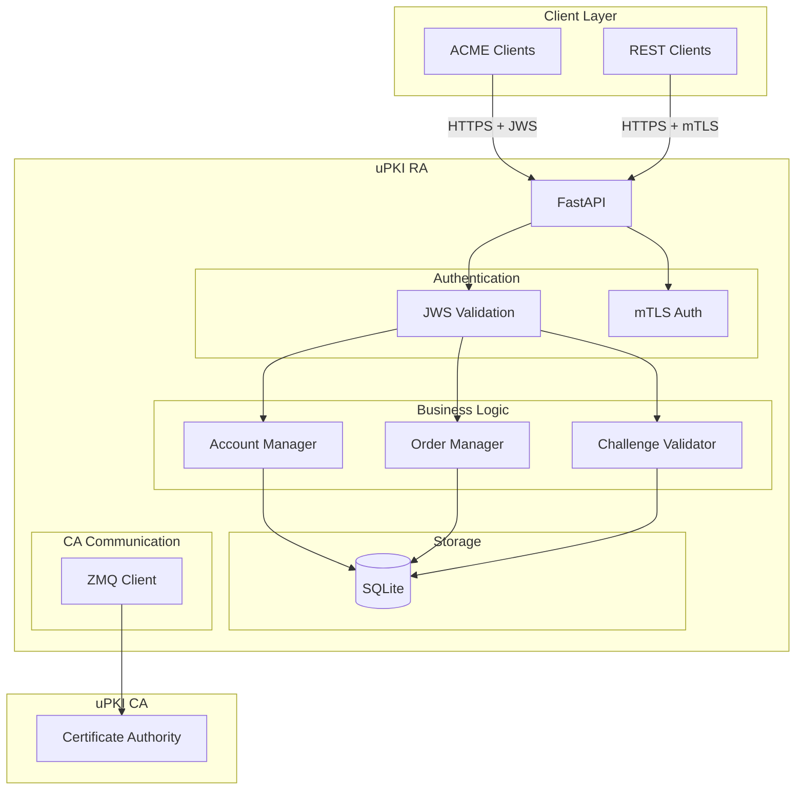
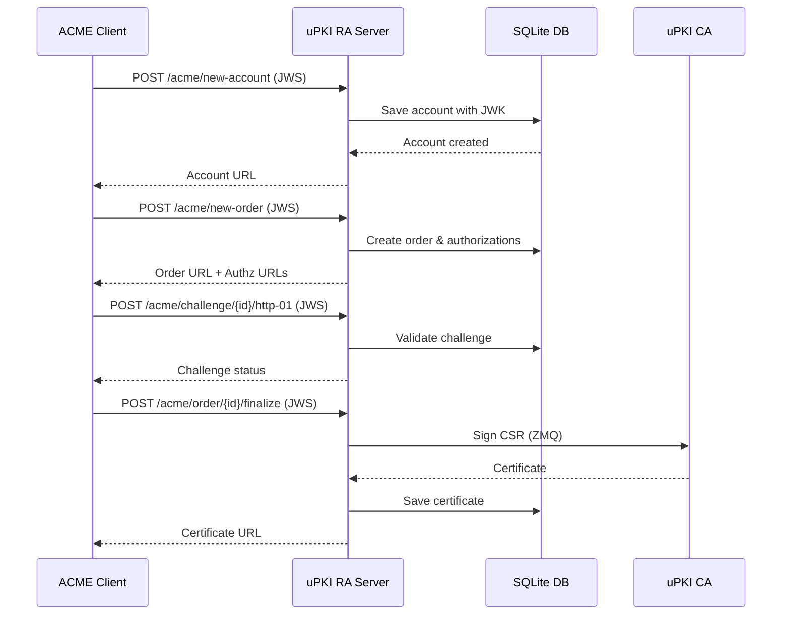
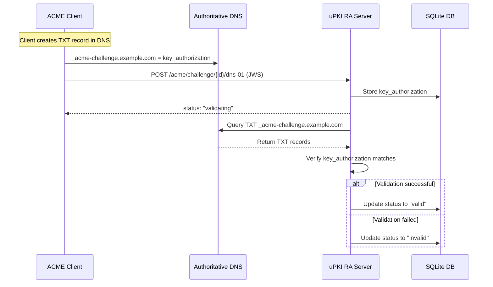

# uPKI RA Server - Project Wiki

## Table of Contents

1. [Introduction](#introduction)
2. [Project Goals](#project-goals)
3. [Architecture Overview](#architecture-overview)
4. [ACME v2 Implementation](#acme-v2-implementation)
5. [Security Model](#security-model)
6. [Deployment Scenarios](#deployment-scenarios)
7. [Troubleshooting](#troubleshooting)

---

## Introduction

uPKI RA Server is the Registration Authority component of the uPKI Public Key Infrastructure system. It provides a modern, protocol-compliant interface for certificate lifecycle management.

### What Makes uPKI Unique

- **First Python ACME Server** - Complete RFC 8555 compliant implementation in Python
- **Multi-Protocol Support** - ACME v2, REST API, and mTLS authentication
- **Kubernetes Native** - Designed for cert-manager integration
- **Open Source** - MIT licensed, community-driven

---

## Project Goals

### Primary Objectives

1. **Simplify Certificate Management**
   - Automated enrollment and renewal via ACME protocol
   - Integration with popular reverse proxies (Traefik)
   - Kubernetes-native deployment with cert-manager

2. **Provide Standards Compliance**
   - Full RFC 8555 (ACME v2) compliance
   - JWS signature verification for all protected endpoints
   - HTTP-01 challenge validation

3. **Enable Modern Infrastructure**
   - Support for automated certificate rotation
   - Integration with existing PKI systems
   - Developer-friendly REST API

### Target Users

- DevOps Engineers managing TLS certificates
- Kubernetes administrators using cert-manager
- Organizations running private PKI infrastructure
- Developers integrating certificate management into applications

---

## Architecture Overview

### Component Design



### Data Flow: Certificate Enrollment



---

## ACME v2 Implementation

### Supported Features

| Feature                | Status | Notes                               |
| ---------------------- | ------ | ----------------------------------- |
| Account Creation       | ✅     | POST /acme/new-account              |
| Account Key Rollover   | ⚠️     | Placeholder (not fully implemented) |
| Order Creation         | ✅     | POST /acme/new-order                |
| HTTP-01 Challenge      | ✅     | POST /acme/challenge/{id}/http-01   |
| DNS-01 Challenge       | ✅     | POST /acme/challenge/{id}/dns-01    |
| Certificate Download   | ✅     | GET /acme/cert/{id}                 |
| Certificate Revocation | ✅     | POST /acme/revoke-cert              |

### DNS-01 Challenge Flow



**Key points:**

- Client creates TXT record in their DNS
- Server queries DNS to verify the record exists
- Uses `dnspython` for DNS resolution
- Both HTTP-01 and DNS-01 supported for each authorization

### Key Authorization

The HTTP-01 challenge uses RFC 8555 compliant key authorization:

```
key_authorization = token + "." + account_key_thumbprint
```

Where `account_key_thumbprint` is the base64url-encoded SHA-256 hash of the account's JWK.

### JWS Signature Verification

The server verifies JWS signatures using:

- **RSA**: RS256, RS384, RS512
- **ECDSA**: ES256, ES384, ES512

Account keys are stored in the local SQLite database and retrieved during request validation.

---

## Security Model

### Authentication Methods

1. **JWS Authentication** (ACME endpoints)
   - All ACME POST requests must be signed by the account's private key
   - Signature verified against stored account JWK
   - Nonce replay protection

2. **mTLS Authentication** (REST endpoints)
   - Client certificates validated against trusted CA
   - Certificate DN authorization for role-based access

3. **API Key Authentication** (Optional)
   - Static API keys for simple integrations

### Authorization Levels

| Endpoint Type  | Required Auth | Access Control     |
| -------------- | ------------- | ------------------ |
| ACME Directory | None          | Public             |
| New Account    | None          | Public             |
| New Order      | JWS           | Account owner only |
| Finalize Order | JWS           | Account owner only |
| Revoke Cert    | JWS           | Account owner only |
| Admin API      | mTLS          | Admin DN only      |
| Client API     | mTLS          | Valid client cert  |

### Data Protection

- Account JWK stored encrypted at rest
- Certificate private keys never stored
- All operations logged for audit

---

## Deployment Scenarios

### Standalone RA

```yaml
services:
  upki-ra:
    image: upki-ra:latest
    ports:
      - "8000:8000"
    environment:
      - CA_HOST=upki-ca
      - CA_PORT=5000
    volumes:
      - ./data:/data
```

### With Kubernetes and cert-manager

```yaml
apiVersion: cert-manager.io/v1
kind: ClusterIssuer
metadata:
  name: upki-issuer
spec:
  acme:
    server: https://ra.internal.example.com/acme/directory
    email: ops@example.com
    privateKeySecretRef:
      name: upki-account-key
    solvers:
      - http01:
          ingressClassName: nginx
```

### With Traefik

See [Traefik Integration Guide](docs/TRAEFIK_INTEGRATION.md) for detailed configuration.

---

## Troubleshooting

### Common Issues

#### 1. Certificate Signing Fails

**Symptom**: POST /acme/order/{id}/finalize returns 500 error

**Solution**:

- Verify RA is registered with CA: `python ra_server.py status`
- Check CA is running and accessible
- Review logs: `tail -f ~/.upki/ra/.ra.log`

#### 2. Challenge Validation Fails

**Symptom**: Challenge status remains "pending"

**Solution**:

- Ensure the `.well-known/acme-challenge/{token}` path is accessible
- Check firewall rules allow HTTP on port 80
- Verify token and key authorization match

#### 3. Account Not Found

**Symptom**: "unauthorized" error on protected endpoints

**Solution**:

- Verify the account ID in the JWS header (kid) is correct
- Ensure the account status is "valid" (not "deactivated")
- Check the JWS signature matches the account's JWK

### Debug Mode

Enable debug logging:

```bash
python ra_server.py listen --debug
```

### Health Check

```bash
curl https://your-server.com/api/v1/health
```

---

## Contributing

Contributions are welcome! Please see the [CONTRIBUTING.md](CONTRIBUTING.md) file for guidelines.

### Development Setup

```bash
git clone https://github.com/circle-rd/upki-ra.git
cd upki-ra
poetry install
poetry run pytest tests/
```

---

## Related Documentation

- [CA ZMQ Protocol](docs/CA_ZMQ_PROTOCOL.md)
- [RA Specifications](docs/SPECIFICATIONS_RA.md)
- [Traefik Integration](docs/TRAEFIK_INTEGRATION.md)
- [uPKI CA Server](https://github.com/circle-rd/upki-ca)
