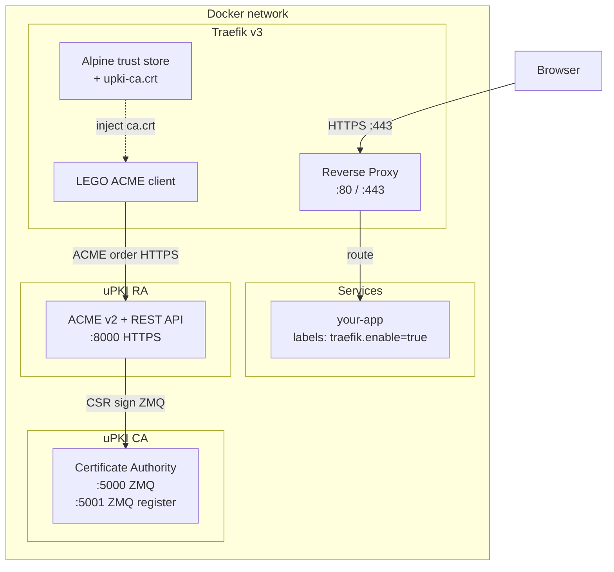

# Traefik Integration

uPKI is designed as a drop-in replacement for Let's Encrypt in environments where internet access is unavailable — private infrastructure, air-gapped networks, corporate LANs. Traefik's built-in ACME client (LEGO) connects directly to uPKI RA as a custom CA server.

## Architecture



## Why uPKI instead of Let's Encrypt?

| Scenario                        | Let's Encrypt | uPKI                |
| ------------------------------- | ------------- | ------------------- |
| Public internet access required | Yes           | **No**              |
| Wildcard certificates           | DNS-01 only   | HTTP-01 or DNS-01   |
| Air-gapped / private networks   | Not possible  | **Fully supported** |
| Custom CA hierarchy             | No            | Yes                 |
| Automated renewal (ACME)        | Yes           | **Yes**             |

## How it works

1. **RA serves HTTPS** — `UPKI_RA_TLS=true` (default in the Docker image) makes uvicorn use the RA's own certificate (`ra.crt` / `ra.key`).
2. **Traefik trusts the internal CA** — the RA certificate is signed by uPKI CA. Before starting, Traefik's Alpine entrypoint injects `ca.crt` from the RA data volume into the system trust store so LEGO can validate the RA's TLS certificate.
3. **LEGO sends an ACME order** — Traefik resolves `https://upki-ra:8000/acme/directory` and follows the RFC 8555 protocol.
4. **RA validates the challenge and signs** — HTTP-01 challenges are validated directly; DNS-01 challenges use dnspython. The RA forwards the CSR to the CA over ZMQ.
5. **Certificate returned to LEGO** — stored in `acme.json`, served to clients on port 443.

## Prerequisites

- Docker Compose v2
- `upki-ca` and `upki-ra` on the same Docker network as Traefik
- Port 80 reachable by the RA for HTTP-01 challenge validation
- `PKI_SEED` environment variable (generated at CA `init` time)

## Quick start

### 1. traefik.yml

```yaml
api:
  insecure: true

log:
  level: INFO

providers:
  docker:
    exposedByDefault: false
    network: demo-net

entryPoints:
  web:
    address: ":80"
  websecure:
    address: ":443"

certificatesResolvers:
  upki:
    acme:
      caServer: https://upki-ra:8000/acme/directory
      storage: /acme/acme.json
      httpChallenge:
        entryPoint: web
```

### 2. docker-compose.yml

```yaml
services:
  upki-ca:
    image: ghcr.io/circle-rd/upki-ca:latest
    restart: unless-stopped
    environment:
      UPKI_DATA_DIR: /data
      UPKI_CA_SEED: ${PKI_SEED}
    volumes:
      - upki-ca-data:/data
    networks:
      - demo-net
    healthcheck:
      test:
        - "CMD-SHELL"
        - >
          python -c "import socket; s=socket.socket(); s.settimeout(2);
          s.connect(('127.0.0.1', 5000)); s.close()"
      interval: 10s
      timeout: 5s
      retries: 10
      start_period: 10s

  upki-ra:
    image: ghcr.io/circle-rd/upki-ra:latest
    restart: unless-stopped
    depends_on:
      upki-ca:
        condition: service_healthy
    environment:
      UPKI_DATA_DIR: /data
      UPKI_CA_HOST: upki-ca
      UPKI_CA_SEED: ${PKI_SEED}
      UPKI_RA_HOST: 0.0.0.0
    volumes:
      - upki-ra-data:/data
    networks:
      - demo-net

  traefik:
    image: traefik:v3
    restart: unless-stopped
    depends_on:
      upki-ra:
        condition: service_healthy
    entrypoint:
      - /bin/sh
      - -c
      - |
        cp /ra-data/ca.crt /usr/local/share/ca-certificates/upki-ca.crt
        update-ca-certificates
        exec traefik
    environment:
      TRAEFIK_CERTIFICATESRESOLVERS_UPKI_ACME_EMAIL: ${ADMIN_EMAIL}
    ports:
      - "80:80"
      - "443:443"
      - "8080:8080"
    volumes:
      - /var/run/docker.sock:/var/run/docker.sock:ro
      - acme:/acme
      - ./traefik.yml:/etc/traefik/traefik.yml:ro
      - upki-ra-data:/ra-data:ro
    networks:
      - demo-net

  your-app:
    image: your-app:latest
    networks:
      - demo-net
    labels:
      - "traefik.enable=true"
      - "traefik.http.routers.your-app.rule=Host(`app.${DOMAIN}`)"
      - "traefik.http.routers.your-app.entrypoints=websecure"
      - "traefik.http.routers.your-app.tls=true"
      - "traefik.http.routers.your-app.tls.certresolver=upki"
      - "traefik.http.services.your-app.loadbalancer.server.port=3000"

volumes:
  upki-ca-data:
  upki-ra-data:
  acme:

networks:
  demo-net:
```

### 3. .env

```bash
PKI_SEED=<generated-by-upki-ca-init>
ADMIN_EMAIL=admin@example.com
DOMAIN=example.internal
```

## DNS resolution

### Docker internal DNS (default)

Docker's embedded DNS resolves container names automatically within a Compose network. This is sufficient for `upki-ra` and `upki-ca` to find each other.

For `Host(`app.${DOMAIN}`)` labels, the domain must resolve to the Docker host. Options:

- **Static `/etc/hosts` entries** — simple but manual
- **Local DNS server** — e.g. `ghcr.io/circle-rd/dns-resolver` which resolves `*.DOMAIN` to the host IP

### DNS-01 challenge

Use DNS-01 when port 80 is unavailable or for wildcard certificates:

```yaml
# traefik.yml
certificatesResolvers:
  upki:
    acme:
      caServer: https://upki-ra:8000/acme/directory
      storage: /acme/acme.json
      dnsChallenge:
        provider: <your-dns-provider>
```

## Kubernetes with cert-manager

```yaml
apiVersion: cert-manager.io/v1
kind: ClusterIssuer
metadata:
  name: upki-issuer
spec:
  acme:
    server: https://upki-ra.upki.svc.cluster.local:8000/acme/directory
    email: admin@example.com
    privateKeySecretRef:
      name: upki-account-key
    caBundle: <base64-encoded-ca.crt>
    solvers:
      - http01:
          ingress:
            ingressClassName: traefik
```

## Traefik labels reference

```yaml
labels:
  - "traefik.enable=true"
  - "traefik.http.routers.<name>.rule=Host(`<hostname>`)"
  - "traefik.http.routers.<name>.entrypoints=websecure"
  - "traefik.http.routers.<name>.tls=true"
  - "traefik.http.routers.<name>.tls.certresolver=upki"
  - "traefik.http.services.<name>.loadbalancer.server.port=<port>"
```

## Troubleshooting

### `x509: certificate signed by unknown authority`

Traefik cannot validate the RA's TLS certificate. Ensure:

- The `upki-ra-data` volume is mounted at `/ra-data` in Traefik.
- The entrypoint copies `ca.crt` before starting Traefik.
- The RA is `healthy` and `ca.crt` is present in the data volume.

### HTTP-01 challenge fails / timeout

- Verify port 80 is forwarded to Traefik.
- Check the `web` entrypoint is configured in `traefik.yml`.
- The RA must reach the challenged domain on port 80.

### `UPKI_CA_SEED is not set`

The `start` command requires `UPKI_CA_SEED` on first boot. Verify it is set and matches the seed printed by `ca_server.py init`.

### `UPKI_RA_SANS` has no effect

`UPKI_RA_SANS` is read only during initial registration. To change the SANs, delete `ra.crt` and `ra.key` from the data volume and restart the container.

### Certificate not renewed

Traefik/LEGO renews certificates at 30 days before expiry. The default `server` profile issues 60-day certificates, so renewal occurs around day 30. Check `acme.json` and Traefik logs.
