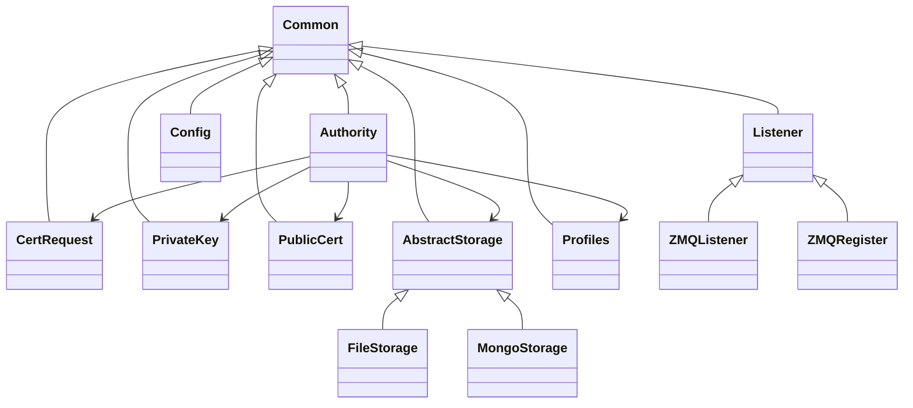

# uPKI CA Server - Specification Document

## Table of Contents

1. [Project Overview](#1-project-overview)
2. [Architecture](#2-architecture)
3. [Main Components](#3-main-components)
4. [Storage Layer](#4-storage-layer)
5. [Communication Protocol](#5-communication-protocol)
6. [Profile System](#6-profile-system)
7. [Security](#7-security)
8. [Configuration](#8-configuration)
9. [API Reference](#9-api-reference)
10. [Data Structures](#10-data-structures)

---

## 1. Project Overview

| Property         | Value                                    |
| ---------------- | ---------------------------------------- |
| **Project Name** | uPKI CA Server                           |
| **Language**     | Python 3.11+                             |
| **Purpose**      | Certificate Authority for PKI operations |
| **License**      | MIT                                      |

### 1.1 Core Capabilities

- X.509 certificate generation and management
- Certificate Signing Request (CSR) processing
- Certificate revocation (CRL generation)
- RA (Registration Authority) server registration
- Private key generation (RSA/DSA)
- Certificate profiles management

---

## 2. Architecture

### 2.1 Project Structure

```
upki_ca/
├── ca/
│   ├── authority.py      # Main CA class
│   ├── cert_request.py    # CSR handler
│   ├── private_key.py     # Private key handler
│   └── public_cert.py     # Certificate handler
├── connectors/
│   ├── listener.py       # Base ZMQ listener
│   ├── zmq_listener.py    # Full CA operations
│   └── zmq_register.py    # RA registration
├── core/
│   ├── common.py         # Base utilities
│   ├── options.py        # Allowed values
│   ├── upki_error.py     # Exceptions
│   ├── upki_logger.py    # Logging
│   └── validators.py     # Input validation
├── storage/
│   ├── abstract_storage.py # Storage interface
│   ├── file_storage.py    # File-based backend
│   └── mongo_storage.py   # MongoDB backend (stub)
├── utils/
│   ├── admins.py         # Admin management
│   ├── config.py         # Configuration
│   └── profiles.py       # Profile management
└── data/
    ├── admin.yml
    ├── ca.yml
    ├── ra.yml
    ├── server.yml
    └── user.yml
```

### 2.2 Class Diagram



---

## 3. Main Components

### 3.1 Authority Class

**File**: [`upki_ca/ca/authority.py`](upki_ca/ca/authority.py:25)

Main CA class handling all PKI operations.

**Responsibilities**:

- CA keychain generation/import
- Certificate issuance
- RA registration server management

**Key Methods**:

```python
def initialize(keychain: str | None = None) -> bool
def load() -> bool
def connect_storage() -> bool
def add_profile(name: str, data: dict) -> bool
def remove_profile(name: str) -> bool
```

### 3.2 CertRequest Class

**File**: [`upki_ca/ca/cert_request.py`](upki_ca/ca/cert_request.py:24)

Handles Certificate Signing Request operations.

**Key Methods**:

```python
def generate(pkey, cn: str, profile: dict, sans: list | None = None) -> CertificateSigningRequest
def load(csr_pem: str) -> CertificateSigningRequest
def export(csr) -> str  # PEM format
def parse(csr) -> dict  # Extract subject, extensions
```

### 3.3 PrivateKey Class

**File**: [`upki_ca/ca/private_key.py`](upki_ca/ca/private_key.py:21)

Handles private key generation and management.

**Key Methods**:

```python
def generate(profile: dict, keyType: str | None = None, keyLen: int | None = None) -> PrivateKey
def load(key_pem: str, password: bytes | None = None) -> PrivateKey
def export(key, encoding: str = "pem", password: bytes | None = None) -> bytes
```

**Supported Key Types**:

- RSA (1024, 2048, 4096 bits)
- DSA (1024, 2048, 4096 bits)

### 3.4 PublicCert Class

**File**: [`upki_ca/ca/public_cert.py`](upki_ca/ca/public_cert.py:26)

Handles X.509 certificate operations.

**Key Methods**:

```python
def generate(csr, issuer_crt, issuer_key, profile: dict,
             ca: bool = False, selfSigned: bool = False,
             start: float | None = None, duration: int | None = None,
             digest: str | None = None, sans: list | None = None) -> Certificate
def load(cert_pem: str) -> Certificate
def export(cert, encoding: str = "pem") -> bytes
def verify(cert, issuer_cert) -> bool
def revoke(cert, reason: str) -> bool
```

---

## 4. Storage Layer

### 4.1 Abstract Storage Interface

**File**: [`upki_ca/storage/abstract_storage.py`](upki_ca/storage/abstract_storage.py:18)

Abstract base class defining the storage interface.

**Required Methods**:

```python
def initialize() -> bool
def connect() -> bool
def serial_exists(serial: int) -> bool
def store_key(pkey: bytes, name: str) -> bool
def get_key(name: str) -> bytes
def store_cert(cert: bytes, name: str, serial: int) -> bool
def get_cert(name: str) -> bytes
def get_cert_by_serial(serial: int) -> bytes
def store_csr(csr: bytes, name: str) -> bool
def get_csr(name: str) -> bytes
def exists(dn: str) -> bool
def list_profiles() -> dict
def store_profile(name: str, data: dict) -> bool
def get_profile(name: str) -> dict
def list_nodes() -> list
def store_node(dn: str, data: dict) -> bool
def get_node(dn: str) -> dict
```

### 4.2 FileStorage Implementation

**File**: [`upki_ca/storage/file_storage.py`](upki_ca/storage/file_storage.py:23)

File-based storage using TinyDB and filesystem.

**Storage Structure**:

```
~/.upki/ca/
├── .serials.json          # Serial number database
├── .nodes.json            # Node/certificate database
├── .admins.json           # Admin database
├── ca.config.yml          # Configuration
├── ca.key                 # CA private key (PEM)
├── ca.crt                 # CA certificate (PEM)
├── profiles/              # Certificate profiles
│   ├── ca.yml
│   ├── ra.yml
│   ├── server.yml
│   └── user.yml
├── certs/                 # Issued certificates
├── reqs/                  # Certificate requests
└── private/              # Private keys
```

**Database Schema** (TinyDB):

- **Serials**: `{serial: int, dn: str, revoked: bool, revoke_reason: str}`
- **Nodes**: `{dn: str, cn: str, profile: str, state: str, serial: int, sans: list}`
- **Admins**: `{dn: str}`

### 4.3 MongoStorage Implementation

**File**: [`upki_ca/storage/mongo_storage.py`](upki_ca/storage/mongo_storage.py:21)

**Status**: Stub implementation (not fully implemented)

**Expected Configuration**:

```python
{
    "host": "localhost",
    "port": 27017,
    "db": "upki",
    "auth_db": "admin",
    "auth_mechanism": "SCRAM-SHA-256",
    "user": "username",
    "pass": "password"
}
```

---

## 5. Communication Protocol

### 5.1 ZMQ Communication

The CA server communicates with RA servers via ZeroMQ.

**Connection Modes**:

1. **Clear Mode**: `register` command - unencrypted for initial RA setup
2. **TLS Mode**: `listen` command - encrypted ZMQ for production

### 5.2 Message Format

**Request**:

```json
{
  "TASK": "register",
  "params": {
    "seed": "registration_seed",
    "cn": "example.com",
    "profile": "server"
  }
}
```

**Response (Success)**:

```json
{
  "EVENT": "ANSWER",
  "DATA": {
    "dn": "/C=FR/O=Company/CN=example.com",
    "certificate": "-----BEGIN CERTIFICATE-----\n..."
  }
}
```

**Response (Error)**:

```json
{
  "EVENT": "UPKI ERROR",
  "MSG": "Error message description"
}
```

### 5.3 Available Tasks

| Task           | Description              | Parameters                       |
| -------------- | ------------------------ | -------------------------------- |
| `get_ca`       | Get CA certificate       | None                             |
| `get_crl`      | Get CRL                  | None                             |
| `generate_crl` | Generate new CRL         | None                             |
| `register`     | Register a new node      | `seed`, `cn`, `profile`, `sans`  |
| `generate`     | Generate certificate     | `cn`, `profile`, `sans`, `local` |
| `sign`         | Sign CSR                 | `csr`, `profile`                 |
| `renew`        | Renew certificate        | `dn`                             |
| `revoke`       | Revoke certificate       | `dn`, `reason`                   |
| `unrevoke`     | Unrevoke certificate     | `dn`                             |
| `delete`       | Delete certificate       | `dn`                             |
| `view`         | View certificate details | `dn`                             |
| `ocsp_check`   | Check OCSP status        | `cert`, `issuer`                 |

---

## 6. Profile System

### 6.1 Profile Structure

**File**: [`upki_ca/utils/profiles.py`](upki_ca/utils/profiles.py:15)

Profiles define certificate parameters and constraints.

```yaml
# server.yml example
---
keyType: "rsa" # rsa, dsa
keyLen: 4096 # 1024, 2048, 4096
duration: 365 # Validity in days
digest: "sha256" # md5, sha1, sha256, sha512
altnames: True # Allow Subject Alternative Names
domain: "kitchen.io" # Default domain

subject: # X.509 Subject DN
  - C: "FR"
  - ST: "PACA"
  - L: "Gap"
  - O: "Kitchen Inc."
  - OU: "Servers"

keyUsage: # Key Usage extensions
  - "digitalSignature"
  - "nonRepudiation"
  - "keyEncipherment"

extendedKeyUsage: # Extended Key Usage
  - "serverAuth"

certType: "server" # user, server, email, sslCA
```

### 6.2 Built-in Profiles

| Profile  | Usage                    | Duration | Key Type |
| -------- | ------------------------ | -------- | -------- |
| `ca`     | CA certificates          | 10 years | RSA 4096 |
| `ra`     | RA certificates          | 1 year   | RSA 4096 |
| `server` | TLS server certificates  | 1 year   | RSA 4096 |
| `user`   | User/client certificates | 30 days  | RSA 4096 |
| `admin`  | Admin certificates       | 1 year   | RSA 4096 |

### 6.3 Profile Validation

Profiles are validated against allowed options defined in [`options.py`](upki_ca/core/options.py:13):

```python
KeyLen: [1024, 2048, 4096]
KeyTypes: ["rsa", "dsa"]
Digest: ["md5", "sha1", "sha256", "sha512"]
CertTypes: ["user", "server", "email", "sslCA"]
Types: ["server", "client", "email", "objsign", "sslCA", "emailCA"]
Usages: ["digitalSignature", "nonRepudiation", "keyEncipherment", ...]
ExtendedUsages: ["serverAuth", "clientAuth", "codeSigning", ...]
Fields: ["C", "ST", "L", "O", "OU", "CN", "emailAddress"]
```

---

## 7. Security

### 7.1 Input Validation

**File**: [`upki_ca/core/validators.py`](upki_ca/core/validators.py:34)

Strict validation following zero-trust principles:

- **FQDNValidator**: RFC 1123 compliant, blocks reserved domains
- **SANValidator**: Whitelist SAN types (DNS, IP, EMAIL)
- **CSRValidator**: Signature and key length verification

### 7.2 Validation Rules

**FQDN Validation**:

- RFC 1123 compliant (alphanumeric, hyphens, dots)
- Max 253 characters, 63 chars per label
- Blocked: `localhost`, `local`, `*.invalid`
- Blocked patterns: `*test*`

**Key Length Requirements**:

- RSA: Minimum 2048 bits
- ECDSA: Minimum P-256

**SAN Types Allowed**:

- DNS (domain names)
- IP (IP addresses)
- EMAIL (email addresses)

### 7.3 Security Best Practices

| Practice              | Implementation                              |
| --------------------- | ------------------------------------------- |
| Private key isolation | Directory permissions 0700                  |
| Encryption at rest    | Optional password protection                |
| Offline CA mode       | Quasi-offline operation, no public REST API |
| Audit logging         | All operations logged with timestamps       |

---

## 8. Configuration

### 8.1 Config File

**File**: [`upki_ca/utils/config.py`](upki_ca/utils/config.py:16)

Configuration file: `~/.upki/ca/ca.config.yml`

```yaml
---
company: "Company Name"
domain: "example.com"
host: "127.0.0.1"
port: 5000
clients: "register" # all, register, manual
password: null # Private key password
seed: null # RA registration seed
```

### 8.2 Configuration Options

| Option     | Type   | Description                                      |
| ---------- | ------ | ------------------------------------------------ |
| `company`  | string | Company name for certificates                    |
| `domain`   | string | Default domain                                   |
| `host`     | string | Listening host                                   |
| `port`     | int    | Listening port                                   |
| `clients`  | string | Client access mode (`all`, `register`, `manual`) |
| `password` | string | Private key encryption password                  |
| `seed`     | string | RA registration seed                             |

### 8.3 CLI Commands

```bash
# Initialize PKI
python ca_server.py init

# Register RA (clear mode)
python ca_server.py register

# Start CA server (TLS mode)
python ca_server.py listen
```

---

## 9. API Reference

### 9.1 ZMQ Listener Methods

**File**: [`upki_ca/connectors/zmq_listener.py`](upki_ca/connectors/zmq_listener.py:29)

#### Admin Management

```python
def _upki_list_admins(params: dict) -> list
def _upki_add_admin(dn: str) -> bool
def _upki_remove_admin(dn: str) -> bool
```

#### Profile Management

```python
def _upki_list_profiles(params: dict) -> dict
def _upki_profile(profile_name: str) -> dict
def _upki_add_profile(params: dict) -> bool
def _upki_update_profile(params: dict) -> bool
def _upki_remove_profile(params: dict) -> bool
```

#### Node/Certificate Management

```python
def _upki_list_nodes(params: dict) -> list
def _upki_get_node(params: dict) -> dict
def _upki_download_node(dn: str) -> str
def _upki_register(params) -> dict
def _upki_generate(params) -> dict
def _upki_sign(params) -> dict
def _upki_update(params) -> dict
def _upki_renew(params) -> dict
def _upki_revoke(params) -> dict
def _upki_unrevoke(params) -> dict
def _upki_delete(params) -> dict
def _upki_view(params) -> dict
```

#### Certificate Status

```python
def _upki_get_crl(params: dict) -> str
def _upki_generate_crl(params: dict) -> dict
def _upki_ocsp_check(params: dict) -> dict
def _upki_get_options(params: dict) -> dict
```

### 9.2 ZMQ Register Methods

**File**: [`upki_ca/connectors/zmq_register.py`](upki_ca/connectors/zmq_register.py:27)

```python
def _upki_list_profiles(params: dict) -> dict
def _upki_register(params: dict) -> dict
def _upki_get_node(params: dict) -> dict
def _upki_done(seed: str) -> bool
def _upki_sign(params: dict) -> dict
```

---

## 10. Data Structures

### 10.1 Node Record

```python
{
    "DN": "/C=FR/O=Company/CN=example.com",
    "CN": "example.com",
    "Profile": "server",
    "State": "active",  # active, revoked, expired
    "Serial": 1234567890,
    "Sans": ["www.example.com", "example.com"]
}
```

### 10.2 Certificate Request

```python
{
    "csr": "-----BEGIN CERTIFICATE REQUEST-----\n...",
    "profile": "server",
    "sans": ["example.com"]
}
```

### 10.3 Certificate Response

```python
{
    "certificate": "-----BEGIN CERTIFICATE-----\n...",
    "dn": "/C=FR/O=Company/CN=example.com",
    "profile": "server",
    "serial": 1234567890,
    "not_before": "2024-01-01T00:00:00Z",
    "not_after": "2025-01-01T00:00:00Z"
}
```

---

## Appendix A: Dependencies

```
cryptography>=3.0
pyzmq>=20.0
tinyDB>=4.0
PyYAML>=5.0
validators>=0.18
```

---

## Appendix B: Error Codes

| Code | Description                  |
| ---- | ---------------------------- |
| 1    | Initialization error         |
| 2    | Profile loading error        |
| 3    | Storage error                |
| 4    | Validation error             |
| 5    | Certificate generation error |
| 6    | Key operation error          |

---

_Document Version: 1.0_
_Last Updated: 2024_
