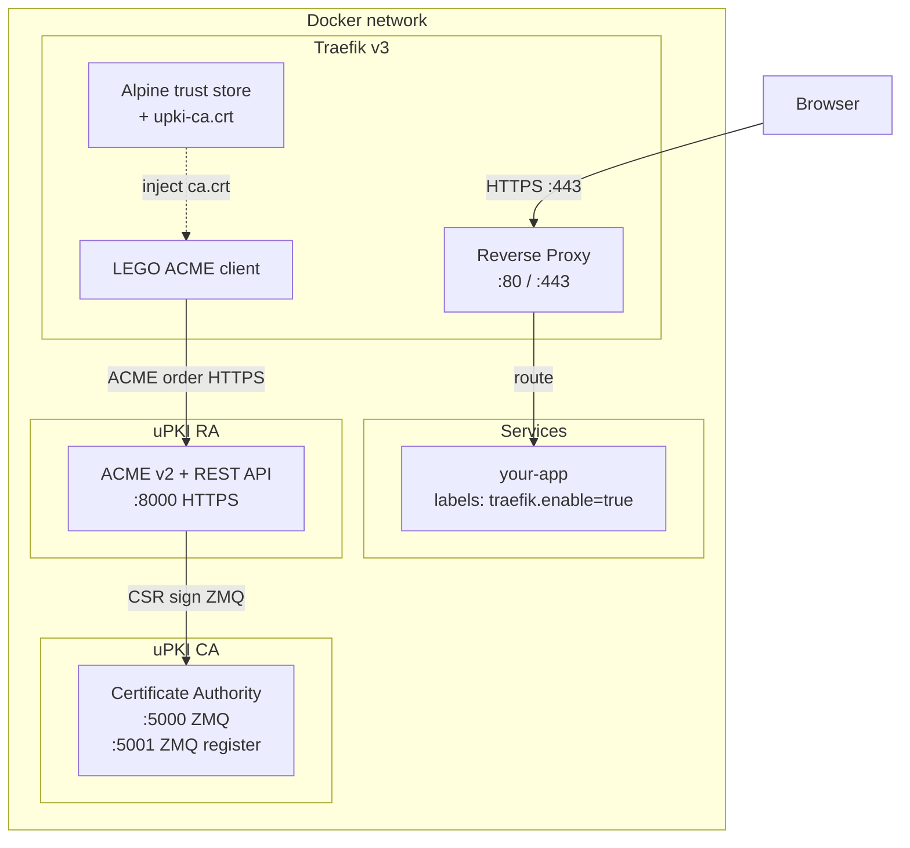

# uPKI RA — Traefik Integration

uPKI is designed as a drop-in replacement for Let's Encrypt in environments where internet access is unavailable (private infrastructure, air-gapped networks, corporate LANs). Traefik's built-in ACME client (LEGO) connects directly to the uPKI RA as a custom CA server, providing fully automated certificate management without any external dependency.

## Architecture



## Why uPKI instead of Let's Encrypt?

| Scenario                        | Let's Encrypt | uPKI                |
| ------------------------------- | ------------- | ------------------- |
| Public internet access required | Yes           | **No**              |
| Wildcard certificates           | DNS-01 only   | HTTP-01 or DNS-01   |
| Air-gapped / private networks   | Not possible  | **Fully supported** |
| Custom CA hierarchy             | No            | Yes                 |
| Automated renewal (ACME)        | Yes           | **Yes**             |

## How It Works

1. **RA serves HTTPS** — `UPKI_RA_TLS=true` (default in the Docker image) makes uvicorn use the RA's own certificate (`ra.crt` / `ra.key`).
2. **Traefik trusts the internal CA** — the RA certificate is signed by the uPKI internal CA. Before starting, Traefik's Alpine entrypoint injects `ca.crt` from the RA data volume into the system trust store, so LEGO can validate the RA's TLS certificate.
3. **LEGO sends an ACME order** — Traefik resolves `https://upki-ra:8000/acme/directory` and follows the RFC 8555 protocol.
4. **RA validates the challenge and signs the certificate** — HTTP-01 challenges are validated directly; DNS-01 challenges use dnspython. The RA forwards the CSR to the CA over ZMQ.
5. **Certificate returned to LEGO** — stored in `acme.json`, served to clients on port 443.

## Prerequisites

- Docker Compose v2
- `upki-ca` and `upki-ra` reachable on the same Docker network as Traefik
- Port 80 reachable by the RA for HTTP-01 challenge validation (or DNS configured for DNS-01)
- A `PKI_SEED` environment variable (generated at CA `init` time, transmitted securely to the RA operator)

## Quick Start

### 1. traefik.yml

```yaml
# traefik.yml — static configuration
# The ACME email is injected via the environment variable
#   TRAEFIK_CERTIFICATESRESOLVERS_UPKI_ACME_EMAIL (set in docker-compose)

api:
  insecure: true

log:
  level: INFO

providers:
  docker:
    exposedByDefault: false
    network: demo-net

entryPoints:
  web:
    address: ":80"
  websecure:
    address: ":443"

certificatesResolvers:
  upki:
    acme:
      # uPKI RA is the custom ACME CA server.
      caServer: https://upki-ra:8000/acme/directory
      storage: /acme/acme.json
      httpChallenge:
        entryPoint: web
```

### 2. docker-compose.yml

```yaml
services:
  # ── PKI: Certificate Authority ───────────────────────────────────────
  upki-ca:
    image: ghcr.io/circle-rd/upki-ca:latest
    restart: unless-stopped
    environment:
      UPKI_DATA_DIR: /data
      UPKI_CA_SEED: ${PKI_SEED}
    volumes:
      - upki-ca-data:/data
    networks:
      - demo-net
    healthcheck:
      test:
        [
          "CMD-SHELL",
          'python -c ''import socket; s=socket.socket(); s.settimeout(2); s.connect(("127.0.0.1", 5000)); s.close()''',
        ]
      interval: 10s
      timeout: 5s
      retries: 10
      start_period: 10s

  # ── PKI: Registration Authority (ACME v2) ────────────────────────────
  upki-ra:
    image: ghcr.io/circle-rd/upki-ra:latest
    restart: unless-stopped
    depends_on:
      upki-ca:
        condition: service_healthy
    environment:
      UPKI_DATA_DIR: /data
      UPKI_CA_HOST: upki-ca
      UPKI_CA_SEED: ${PKI_SEED}
      UPKI_RA_HOST: 0.0.0.0
      # UPKI_RA_TLS=true and UPKI_RA_SANS=upki-ra are already set in the
      # Docker image defaults. Redeclare here only to override them.
    volumes:
      - upki-ra-data:/data
    networks:
      - demo-net

  # ── Reverse-proxy ────────────────────────────────────────────────────
  traefik:
    image: traefik:v3
    restart: unless-stopped
    depends_on:
      upki-ra:
        condition: service_healthy
    # Inject the uPKI CA root certificate into Alpine's trust store before
    # starting Traefik so that LEGO validates the RA's HTTPS endpoint.
    entrypoint:
      - /bin/sh
      - -c
      - |
        cp /ra-data/ca.crt /usr/local/share/ca-certificates/upki-ca.crt
        update-ca-certificates
        exec traefik
    environment:
      # Injected as an env var because the static config file cannot expand
      # Compose variable syntax.
      TRAEFIK_CERTIFICATESRESOLVERS_UPKI_ACME_EMAIL: ${ADMIN_EMAIL}
    ports:
      - "80:80"
      - "443:443"
      - "8080:8080" # Traefik dashboard (disable in production)
    volumes:
      - /var/run/docker.sock:/var/run/docker.sock:ro
      - acme:/acme
      - ./traefik.yml:/etc/traefik/traefik.yml:ro
      # Mount RA data volume (read-only) to access ca.crt for trust injection.
      - upki-ra-data:/ra-data:ro
    networks:
      - demo-net

  # ── Your service ─────────────────────────────────────────────────────
  your-app:
    image: your-app:latest
    networks:
      - demo-net
    labels:
      - "traefik.enable=true"
      - "traefik.http.routers.your-app.rule=Host(`app.${DOMAIN}`)"
      - "traefik.http.routers.your-app.entrypoints=websecure"
      - "traefik.http.routers.your-app.tls=true"
      - "traefik.http.routers.your-app.tls.certresolver=upki"
      - "traefik.http.services.your-app.loadbalancer.server.port=3000"

volumes:
  upki-ca-data:
  upki-ra-data:
  acme:

networks:
  demo-net:
```

### 3. .env

```bash
PKI_SEED=<generated-by-upki-ca-init>   # CA registration seed
ADMIN_EMAIL=admin@example.com
DOMAIN=example.internal
```

## DNS Resolution

### Docker internal DNS (default)

Docker's embedded DNS resolver resolves container names automatically within a Compose network. This is sufficient for `upki-ra` and `upki-ca` to find each other.

For service labels using `Host(`app.${DOMAIN}`)`, the domain must resolve to the Docker host IP. Options:

- **Static `/etc/hosts` entries** — simple but manual
- **Local DNS server** — e.g. `ghcr.io/circle-rd/dns-resolver` which resolves `*.DOMAIN` to the host IP and container names within the Docker network

### DNS-01 Challenge (alternative to HTTP-01)

Use DNS-01 when port 80 is not accessible or when wildcard certificates are needed:

```yaml
# traefik.yml
certificatesResolvers:
  upki:
    acme:
      caServer: https://upki-ra:8000/acme/directory
      storage: /acme/acme.json
      dnsChallenge:
        provider: <your-dns-provider>
        resolvers:
          - "1.1.1.1:53"
```

The uPKI RA validates DNS-01 challenges using dnspython. The DNS provider must be supported by LEGO. For fully private networks with a custom DNS server, configure the resolver to point to it.

## Kubernetes with cert-manager

For Kubernetes environments, use cert-manager with uPKI as the ACME server:

```yaml
apiVersion: cert-manager.io/v1
kind: ClusterIssuer
metadata:
  name: upki-issuer
spec:
  acme:
    server: https://upki-ra.upki.svc.cluster.local:8000/acme/directory
    email: admin@example.com
    privateKeySecretRef:
      name: upki-account-key
    caBundle: <base64-encoded-ca.crt> # uPKI root CA certificate
    solvers:
      - http01:
          ingress:
            ingressClassName: traefik
```

## Traefik Service Labels Reference

```yaml
labels:
  # Enable Traefik for this service
  - "traefik.enable=true"

  # Route by hostname
  - "traefik.http.routers.<name>.rule=Host(`<hostname>`)"

  # Use the HTTPS entrypoint
  - "traefik.http.routers.<name>.entrypoints=websecure"

  # Enable TLS
  - "traefik.http.routers.<name>.tls=true"

  # Use the uPKI certificate resolver
  - "traefik.http.routers.<name>.tls.certresolver=upki"

  # Backend port
  - "traefik.http.services.<name>.loadbalancer.server.port=<port>"

  # Optional: HTTP → HTTPS redirect on the web entrypoint
  - "traefik.http.routers.<name>-http.rule=Host(`<hostname>`)"
  - "traefik.http.routers.<name>-http.entrypoints=web"
  - "traefik.http.routers.<name>-http.middlewares=redirect-https"
  - "traefik.http.middlewares.redirect-https.redirectscheme.scheme=https"
```

## Troubleshooting

### `x509: certificate signed by unknown authority`

Traefik cannot validate the RA's TLS certificate. Ensure:

- The `upki-ra-data` volume is mounted at `/ra-data` in the Traefik container.
- The entrypoint copies `ca.crt` before running `traefik` (see the `entrypoint` block above).
- The RA has fully registered and `ca.crt` is present in the data volume (wait for `upki-ra` to be `healthy`).

### HTTP-01 challenge fails / timeout

- Verify port 80 on the host is forwarded to Traefik.
- Check that the `web` entrypoint is configured in `traefik.yml`.
- The RA must be able to reach the challenged domain on port 80 to self-validate. If the RA and Traefik are on the same Docker network and the domain resolves to the host IP, this works transparently.

### RA not registered — `UPKI_CA_SEED is not set`

The `start` command requires `UPKI_CA_SEED` on the first boot to register with the CA. Verify the environment variable is set in docker-compose and matches the seed printed by `ca_server.py init`.

### `UPKI_RA_SANS` has no effect after first boot

`UPKI_RA_SANS` is only read during the initial registration. The DNS SANs are embedded in the RA certificate at that point. To change them, delete the `ra.crt` and `ra.key` files from the data volume and restart the container so re-registration is triggered.

### Certificate not renewed

Traefik/LEGO renews certificates automatically when they reach 30 days before expiry. The default RA certificate profile (`server`) issues 60-day certificates, so renewal happens around day 30. Check `acme.json` and Traefik logs if renewal does not occur.
